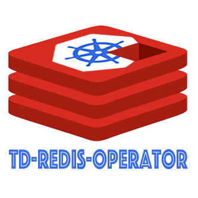
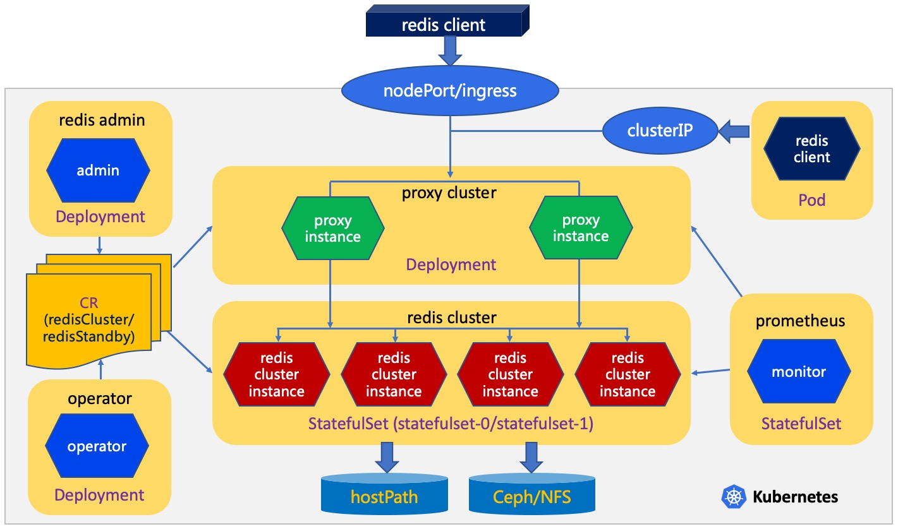
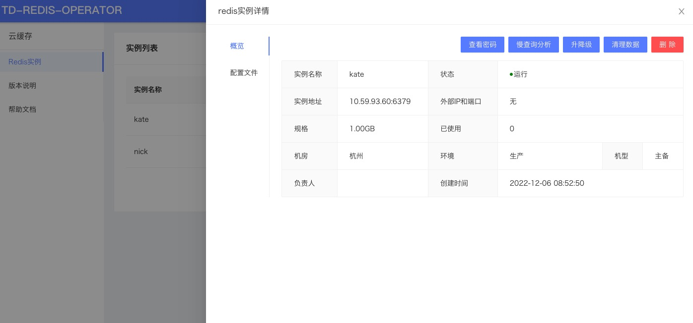

<a href="README-zh.md">中文文档</a>  |  <a href="README.md">English Documents</a>

<br>

<div class="blog_content">
    <div class="iteye-blog-content-contain" style="font-size: 14px;">
<h1>项目背景</h1>
<p style="font-size: 14px;">
&nbsp;&nbsp;&nbsp;<a href="https://www.tongdun.net">同盾科技</a>作为中国第三方智能风控与决策服务的头部提供商，日均处理决策请求高达百亿次。因此在同盾的主体数据存储基础架构中，大量使用Redis做为缓存组件。在业务高峰时期，集群实际部署高达千余Redis实例，这势必对DBA运维管控带来极大挑战。2018年，集团推动无状态应用全面容器化，结合云原生技术的缓存云产品开始在数据存储和云原生团队内部酝酿落地。 </p>
<p style="font-size: 14px;">
&nbsp;&nbsp;&nbsp;td-redis-operator第一版本可追溯到2018年，此次外部开源的版本为第2版，开发时间从2018年7月份一直持续到现在，目前同盾两地双中心的Redis集群全部部署在超大规模的Kubernetes上。
</p>
<strong>目前使用规模：</strong>
<ol style="font-size: 14px;">
<li>Redis实例5000+</li>
<li>PB级别数据量</li>
<li>涉及1000+个在线实时业务</li>
</ol>

<h1>项目介绍</h1>
<p style="margin-top: 15px; margin-bottom: 15px; color: #333333; font-family: Helvetica, arial, freesans, clean, sans-serif; font-size: 15px; line-height: 25px;">名称：td-redis-operator</p>
<p style="margin-top: 15px; margin-bottom: 15px; color: #333333; font-family: Helvetica, arial, freesans, clean, sans-serif; font-size: 15px; line-height: 25px;">语言：Golang</p>
<p style="margin-top: 15px; margin-bottom: 15px; color: #333333; font-family: Helvetica, arial, freesans, clean, sans-serif; font-size: 15px; line-height: 25px;">定位：完全基于云原生技术，实现资源生命周期管理、故障自愈、HA等</p>
<p style="margin-top: 15px; margin-bottom: 15px; color: #333333; font-family: Helvetica, arial, freesans, clean, sans-serif; font-size: 15px; line-height: 25px;">介绍：https://github.com/tongdun/td-redis-operator/wiki/基本介绍</p>
<p> </p>
<h1>工作原理</h1>
<p></p>
<p>原理描述：</p>
<p>1. 基于<a href="https://kubernetes.io/docs/concepts/extend-kubernetes/operator/"> Kubernetes Operator </a>开源产品，完全在kubernetes上运维托管。</p>
<p>2. 支持两种Redis实例管理交付，即Redis主备和Redis Cluster。</p>
<br>
        
<h1>QuickStart</h1>
        
<p>你可以使用helm命令来部署：</p>

```
$ helm repo add td-redis-operator https://tongdun.github.io/td-redis-operator/charts/td-redis-operator
$ helm repo update
$ helm install [RELEASE_NAME] td-redis-operator/td-redis-operator      
```
<p>关于helm的部署过程详见<a href="https://github.com/tongdun/td-redis-operator/wiki/Helm部署">Helm部署文档</a>。</p>
        
<p>除了使用helm部署外，你也可以使用kubectl命令部署：</p>

```
$ kubectl apply -f https://raw.githubusercontent.com/tongdun/td-redis-operator/main/deploy/deploy.yaml
$ kubectl apply -f https://raw.githubusercontent.com/tongdun/td-redis-operator/main/cr/redis_cluster.yaml
$ kubectl apply -f https://raw.githubusercontent.com/tongdun/td-redis-operator/main/cr/redis_standby.yaml
```
<p>更多YAML文件详见<a href="https://github.com/tongdun/td-redis-operator/wiki/YAML部署">YAML部署文档</a>。</p>

</div>

<br>

# Admin Guide
   
除了可以通过命令行来操作td-redis-operator，还可以通过Web界面来进行操作。



更多操作手册可以查看 <a href="https://github.com/tongdun/td-redis-operator/wiki/管理指南"> td-redis-operator管理指南 </a>。
    
<br>
    
# 常见问题
    
你可以<a href="https://github.com/tongdun/td-redis-operator/wiki/常见问题回答">点击这里查看常见问题集锦</a>，也可以<a href="https://github.com/tongdun/td-redis-operator/issues">点击这里给我们提交issue</a>。

<br>
    
# 社区微信群
    
欢迎扫码加入我们的开源社区微信群，进行详细的沟通交流：
    
  
    
(申请的时候备注填写“td-redis-operator”字符。)
   
    
<br>
    
# Wiki文档
    
[https://github.com/tongdun/td-redis-operator/wiki](https://github.com/tongdun/td-redis-operator/wiki/首页)


<br>
<br>

